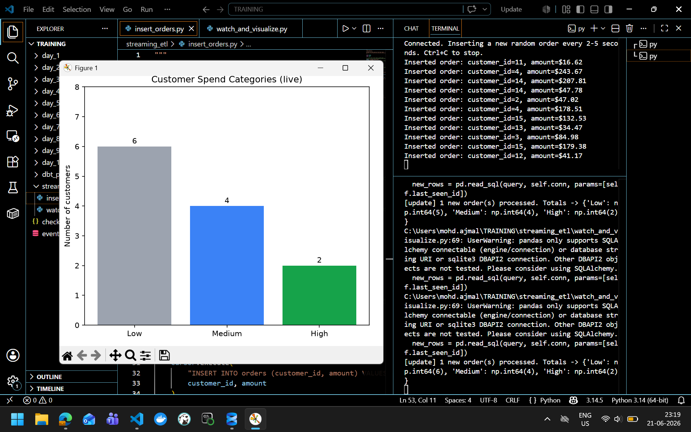

# Streaming ETL Pipeline — SQL Server → Live Chart

A simple Python ETL pipeline that watches an MS-SQL (LocalDB) database for new orders and updates a live matplotlib bar chart categorizing customers as **High**, **Medium**, or **Low** spenders in real time.

---

## Screenshot



---

## How It Works

```
insert_orders.py          watch_and_visualize.py
─────────────────         ──────────────────────────────────────────
Inserts a random    ───►  Polls DB every 3s for new rows  (Extract)
order every 2–5s          Calculates total spend/customer (Transform)
                          Redraws bar chart                   (Load)
```

**Change detection:** tracks the highest `order_id` seen — each poll fetches only rows newer than that. No triggers or CDC needed.

**Spend thresholds:**
| Category | Total Spend |
|----------|-------------|
| 🟢 High   | ≥ $500      |
| 🔵 Medium | ≥ $200      |
| ⚪ Low    | < $200      |

---

## Setup

**1. Create the database** — run `setup_database.sql` in SSMS against your LocalDB instance.

**2. Install dependencies**
```bash
pip install -r requirements.txt
```

**3. Run the watcher** (opens the live chart)
```bash
python watch_and_visualize.py
```

**4. Run the producer** (starts inserting random orders)
```bash
python insert_orders.py
```

The chart refreshes automatically as new orders land.

---

## Requirements

- Python 3.8+
- MS SQL Server LocalDB (`(localdb)\MSSQLLocalDB`)
- ODBC Driver 17 for SQL Server

---

## Project Structure

```
├── setup_database.sql       # Create DB and orders table
├── insert_orders.py         # Simulates incoming orders
├── watch_and_visualize.py   # ETL watcher + live chart
├── requirements.txt
└── images/
    └── screenshot.png       # Add your screenshot here
```
